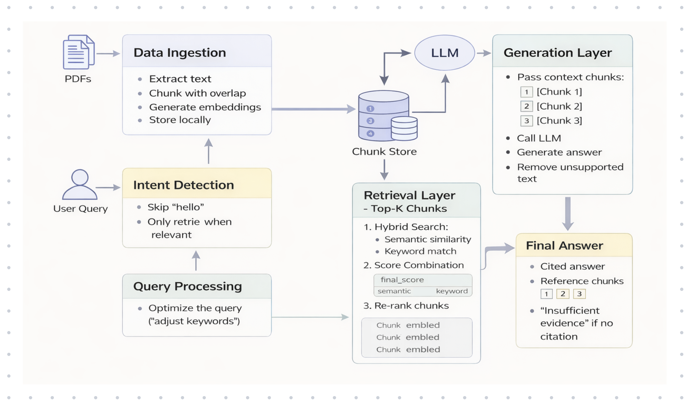
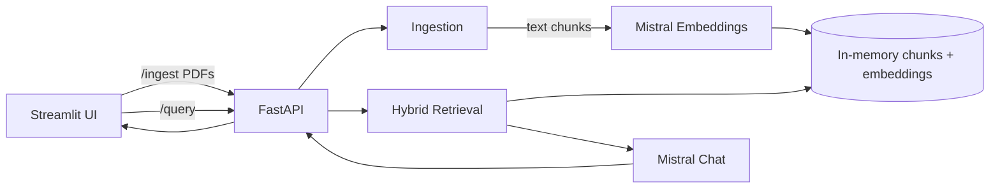

# Custom RAG for PDF Q&A

A minimal Retrieval-Augmented Generation (RAG) system that ingests PDFs, builds in-memory embeddings, and answers questions through a hybrid retrieval pipeline. The backend is a FastAPI service, and the UI is a Streamlit app.

## Setup

There are 2 options on how to run it - using Docker or Python Venv. In both cases, you must first add your Mistral API key: add it to file [.env.example](.env.example) and copy it to `.env`:

```
cp .env.example .env
```

### Option 1 - Docker

1. Ensure Docker Desktop is running.
1. 

Build and start containers:

```bash
docker compose up --build
```

5. Open:

- UI: http://localhost:8501
- API: http://localhost:8000

To stop containers:

```bash
docker compose down
```


### Option 2 - Python Venv

1. Create a virtual environment and install dependencies:

```bash
python -m venv .venv
source .venv/bin/activate
pip install -r requirements.txt
```

#### Run the backend (FastAPI)

```bash
uvicorn app.main:app --reload
```

The API will be available at `http://localhost:8000`.

#### Run the frontend (Streamlit)

```bash
streamlit run ui/app.py
```

The UI will be available at `http://localhost:8501`.

---

## System design

**Components**

- **Ingestion**: Extracts text from uploaded PDFs, chunks it, and calls Mistral embeddings.
- **Retrieval**: Combines semantic similarity with keyword (TF-IDF) similarity to rank chunks.
- **Generation**: Uses top-ranked chunks to prompt a Mistral chat model.
- **API**: FastAPI endpoints for ingesting PDFs and querying.
- **UI**: Streamlit client to upload PDFs and ask questions.

**Architecture**



**Data flow**

1. User uploads PDFs via Streamlit.
2. FastAPI `/ingest` extracts text, chunks it, and stores embeddings in memory.
3. User submits a query via Streamlit.
4. FastAPI `/query` runs hybrid search and generates an answer.
5. UI displays the answer and top supporting chunks.



**Retrieval logic**

- Semantic search uses Mistral embeddings + cosine similarity.
- Keyword search uses TF-IDF + cosine similarity.
- Scores are combined with a weighted sum, then top-k chunks are returned.

### Project structure

- [app/main.py](app/main.py): FastAPI app and endpoints.
- [app/ingestion.py](app/ingestion.py): PDF parsing, chunking, embeddings.
- [app/retrieval.py](app/retrieval.py): Hybrid search and query processing.
- [app/generation.py](app/generation.py): Answer generation with Mistral.
- [app/config.py](app/config.py): Config constants.
- [ui/app.py](ui/app.py): Streamlit UI.

### Requirements

- Python 3.10+
- A Mistral API key

### API endpoints

- `POST /ingest`: Upload PDF files as multipart form data (`files`).
- `POST /query`: JSON body `{ "query": "..." }`.
- `GET /health`: Health check.

### Notes and limitations

- Embeddings and chunks are stored in memory only (no persistence).
- The system assumes PDFs contain extractable text (not scanned images).
- A low similarity threshold can return weak matches; tune `SIMILARITY_THRESHOLD` in [app/config.py](app/config.py).

### Troubleshooting

- If embeddings fail, verify the Mistral API key and model availability.
- If no chunks are returned, ingest a PDF first and confirm chunk count in logs.

### Sources used

* **[Augment your LLMs using RAG](https://www.databricks.com/resources/ebook/train-llms-your-data?scid=7018Y000001Fi0MQAS&utm_medium=paid+search&utm_source=google&utm_campaign=17102589780&utm_adgroup=171145795156&utm_content=ebook&utm_offer=train-llms-your-data&utm_ad=794749576974&utm_term=retrieval%20augmented%20generation&gad_source=1&gad_campaignid=17102589780&gbraid=0AAAAABYBeAhn87co6p969eFaZHsV7oklm&gclid=CjwKCAiA-sXMBhAOEiwAGGw6LIqq8WSpbFFZMeEtL28F2aPkSgqpTQUBfbGm13x5u6GWqDZ3dvxlCBoCZVEQAvD_BwE) - Databricks**
* **[What is RAG? ](https://blogs.nvidia.com/blog/what-is-retrieval-augmented-generation/)**- **NVIDIA**

### To Do

* [X] Create a simple PDF ingestion code
* [X] Create functionality for query processing
* [X] Implement retrieval system
* [X] Implement generation with prompt
* [X] Organize all into backend system
* [X] Create simple UI on Streamlit
* [X] Dockerize
* [X] Modify README
